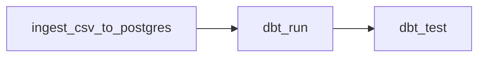
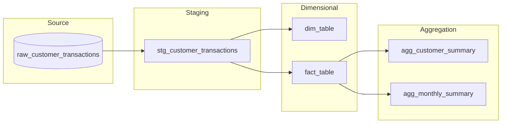
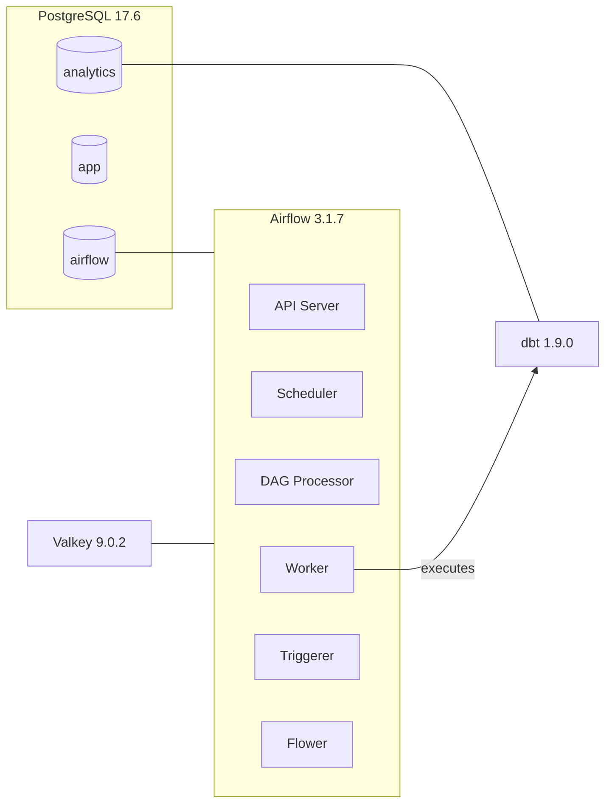

# Customer Transactions Pipeline

End-to-end data pipeline that ingests raw transaction data from CSV, cleans and transforms it into a dimensional model using dbt, and orchestrates everything with Apache Airflow.

## Prerequisites

- **Docker Engine** with at least 4 GB of RAM allocated (8 GB recommended).
- **Docker Compose v2.14.0** or higher.
- At least **2 CPUs** and **10 GB of free disk space**.

## Quick start

```bash
# 1. Create the environment file from the template
cp .env.example .env

# 2. (Linux only) Set the host user UID
echo "AIRFLOW_UID=$(id -u)" >> .env

# 3. Build the custom Airflow image (installs the project package and dependencies)
docker compose build

# 4. Initialise the database and create the admin user
docker compose up airflow-init

# 5. Start all services
docker compose up -d

# 6. Verify services are healthy
docker compose ps

# 7. Verify dbt connection
docker compose --profile dbt run --rm dbt debug

# 8. If needed to shut down the volumes
docker compose down -v
```

> **Note:** The business logic lives in `src/ebury_customer_transactions/` and is installed as a Python package at build time via `pip install .` (reads `pyproject.toml`). Dependencies (pandas, dbt-postgres, psycopg, etc.) are baked into the image. After the first build, restarts are instant. Only rebuild when dependencies or `src/` code change: `docker compose up -d --build`.

Once running, access points are:

| Service | URL |
|---|---|
| Airflow UI / API | <http://localhost:8080> |
| Flower (Celery monitoring) | <http://localhost:5555> |
| PostgreSQL | localhost:5432 |

> **Nota sobre Celery y Flower:** La arquitectura usa `CeleryExecutor` con Valkey como broker, lo que permite escalar workers horizontalmente (`--scale airflow-worker=N`). Flower es el dashboard de monitorización de Celery en tiempo real (estado de workers, cola de tareas, historial). No se activa por defecto porque en un entorno de demo con un solo worker no es necesario, pero está preconfigurado para habilitarse con `docker compose --profile flower up -d` cuando se necesite monitorizar múltiples workers en producción.

## Pipeline overview

The pipeline is defined as a single Airflow DAG (`customer_transactions_pipeline`) with three sequential tasks:



1. **ingest_csv_to_postgres** — Reads `data/customer_transactions.csv`, loads all columns as TEXT into PostgreSQL (`raw_customer_transactions`) using `COPY` for efficiency. Full-refresh (drop + recreate) on every run to guarantee idempotency.
2. **dbt_run** — Executes all dbt models: staging (cleaning/normalisation), dimensional (dim + fact), and aggregation layers.
3. **dbt_test** — Runs dbt tests to validate data quality constraints (uniqueness, not-null, referential integrity).

The DAG is configured with `retries=2` and `retry_delay=1min` by default. Schedule is set to `None` (manual trigger) so it can be triggered on-demand or switched to a cron expression for production.

## Data model

### Staging layer

| Model | Description |
|---|---|
| `stg_customer_transactions` | Cleans and normalises raw data: strips prefixes (`T`, `P`), casts types, normalises mixed date formats (`YYYY-MM-DD` / `DD-MM-YYYY`), converts text numbers (`"Two Hundred"` → `200`), and handles missing values as NULLs. |

### Dimensional layer

| Model | Type | Description |
|---|---|---|
| `dim_table` | Dimension | Deduplicated product catalogue (`product_id`, `product_name`). |
| `fact_table` | Fact | One row per transaction with calculated metrics: `total_amount = (price * quantity) + tax` and `transaction_month` for monthly aggregation. |

### Aggregation layer

| Model | Description |
|---|---|
| `agg_customer_summary` | Customer-level metrics: total transactions, unique products, gross revenue, total tax, total spent, average ticket, first/last purchase date. |
| `agg_monthly_summary` | Monthly metrics: transaction count, unique customers/products, gross revenue, total tax, total revenue, average ticket. |

### Lineage



## Data quality

### Approach

Data quality is addressed at multiple levels:

1. **Ingestion** — All columns are loaded as TEXT to preserve the original values without any implicit casting or data loss. This ensures that cleaning decisions are explicit and auditable in dbt.

2. **Staging (dbt)** — The `stg_customer_transactions` model handles every known data issue in the CSV:
   - **Prefixed IDs**: `T1010` → `1010`, `P100` → `100` (regex strip + cast)
   - **Float-formatted integers**: `501.0` → `501` (strip `.0` suffix)
   - **Mixed date formats**: `YYYY-MM-DD` and `DD-MM-YYYY` normalised to `DATE`
   - **Text-encoded numbers**: `"Two Hundred"` → `200.00`, `"Fifteen"` → `15.00`
   - **Missing values**: Empty strings → `NULL` (explicit, not implicit via pandas `NaN`)

3. **dbt tests** — Schema-level tests enforce constraints across all layers:
   - `unique` + `not_null` on primary keys (`transaction_id`, `product_id`, `customer_id`)
   - `not_null` on critical fields (`transaction_date`, `product_name`, `total_amount`)
   - `relationships` test on `fact_table.product_id` → `dim_table.product_id` (referential integrity)

4. **Pipeline enforcement** — `dbt_test` runs as the final DAG task. If any test fails, the task (and the DAG run) is marked as failed, preventing silent data corruption.

### Known limitations and future improvements

- Text-to-number mappings (`"Two Hundred"`, `"Fifteen"`) are hardcoded for the known dataset. In production, this should be replaced by a lookup table or a more generic parsing macro.
- Source freshness (`loaded_at_field`) is not yet configured. Adding it would enable alerting when data becomes stale.
- ~~Custom singular tests (e.g., `total_amount >= 0`, `transaction_date` within expected range) would add an extra validation layer.~~ **Done** — see `dbt/tests/`.

## Data governance

- **Separation of concerns** — Three isolated PostgreSQL databases: `app` (application), `airflow` (orchestration metadata), and `analytics` (dbt warehouse). Each with its own credentials created via `init-db.sh`.
- **Least privilege** — Dedicated database roles (`airflow`, `dbt`, `app`) with access restricted to their own database.
- **Secrets management** — All credentials are injected via `.env` (not committed to version control). `.env.example` provides a template with placeholder values.
- **Data lineage** — dbt natively tracks model dependencies. Run `dbt docs generate && dbt docs serve` to explore the full lineage graph.
- **Schema contracts** — dbt `schema.yml` files serve as data contracts: they document every column and enforce quality expectations via tests.
- **Auditability** — Raw data is preserved in `raw_customer_transactions` (all TEXT). Every transformation is explicit in SQL, making changes reviewable via version control.

## Optimisation decisions

| Decision | Rationale |
|---|---|
| `COPY` instead of row-by-row `INSERT` | PostgreSQL `COPY` is the fastest bulk-loading method; avoids per-row overhead. |
| `dtype=str` in pandas `read_csv` | Prevents pandas from guessing types (and silently corrupting data). All casting is deferred to dbt. |
| `CeleryExecutor` with Valkey | Enables horizontal scaling of workers (`--scale airflow-worker=N`). Valkey is Redis-compatible with BSD license. |
| `noeviction` memory policy on Valkey | Prevents message loss; broker rejects new tasks instead of silently dropping queued ones. |
| `materialized='table'` for all dbt models | Full-refresh tables ensure consistency and simplify debugging. Incremental models can be adopted later if volume grows. |
| Full-refresh ingestion (DROP + CREATE) | Guarantees idempotency: re-running the DAG always produces the same result regardless of prior state. |
| `DUMB_INIT_SETSID=0` on workers | Enables graceful shutdown: in-flight tasks finish before the container stops. |

## Service architecture



### Service descriptions

| Service | Description |
|---|---|
| **postgres** | Shared PostgreSQL 17.6 instance. Hosts the application database (`POSTGRES_DB`), Airflow metadata database (`AIRFLOW_DB_NAME`), and dbt analytics database (`DBT_DB_NAME`). The latter two are auto-created by `init-db.sh` on first boot. |
| **valkey** | Valkey 9.0.2 message broker (open-source Redis fork, BSD licensed). Acts as the Celery task queue between the scheduler and workers. Internal-only (not exposed to host). Password-protected, AOF persistence enabled, configurable memory limit. 100% Redis protocol compatible. |
| **airflow-apiserver** | Serves the Airflow web UI and REST API v2. Main entry point for users and for internal worker communication via the Execution API. |
| **airflow-scheduler** | Monitors all DAGs and their tasks. Determines when a task is ready (dependencies met, schedule reached) and enqueues it in Valkey for a worker to pick up. |
| **airflow-dag-processor** | Dedicated process (new in Airflow 3.x) that parses Python files from `dags/` and registers them in the database. In Airflow 2.x this was handled by the scheduler directly. |
| **airflow-worker** | Celery worker that executes queued tasks. Can be scaled horizontally (`docker compose up -d --scale airflow-worker=3`). |
| **airflow-triggerer** | Manages deferrable operators. Runs async event loops that wait for external conditions without occupying a worker slot. |
| **airflow-init** | One-shot service that runs before everything else. Migrates the database schema, creates the admin user, and checks host resources (RAM, CPU, disk). |
| **airflow-cli** | Helper container for running ad-hoc `airflow` commands. Only starts under the `debug` profile. |
| **flower** | Web dashboard for real-time Celery worker monitoring. Only starts under the `flower` profile. |
| **dbt** | dbt-postgres 1.9.0 for data transformations. One-shot service under the `dbt` profile via `docker compose --profile dbt run --rm dbt <command>`. Connects to the dedicated `analytics` database. |

## Environment variables

All variables are defined in `.env` (copy from `.env.example`). Airflow config can be overridden via `AIRFLOW__<SECTION>__<KEY>` environment variables, which take precedence over `config/airflow.cfg`.

On Linux, set `AIRFLOW_UID=$(id -u)` in `.env` to match host user permissions on mounted volumes. macOS/Windows can use the default (`50000`).

### PostgreSQL

| Variable | Default | Description |
|---|---|---|
| `POSTGRES_USER` | `app` | PostgreSQL superuser name. Created on first container initialisation. |
| `POSTGRES_PASSWORD` | `changeme` | PostgreSQL superuser password. **Must be changed** in any non-local environment. |
| `POSTGRES_DB` | `app` | Main application database created on startup. |
| `POSTGRES_PORT` | `5432` | Host port mapped to the container's 5432. |

### Valkey

| Variable | Default | Description |
|---|---|---|
| `VALKEY_PASSWORD` | `changeme` | Valkey authentication password. Injected into both the server `--requirepass` and Celery's `BROKER_URL`. |
| `VALKEY_IMAGE_NAME` | `valkey/valkey:9.0.2` | Docker image for Valkey. |
| `VALKEY_MAXMEMORY` | `256mb` | Maximum memory. Policy is `noeviction`: rejects writes at limit instead of dropping keys. |

### Airflow database

| Variable | Default | Description |
|---|---|---|
| `AIRFLOW_DB_USER` | `airflow` | Dedicated PostgreSQL role for Airflow. Auto-created via `init-db.sh`. |
| `AIRFLOW_DB_PASSWORD` | `airflow` | Password for `AIRFLOW_DB_USER`. **Must be changed** in non-local environments. |
| `AIRFLOW_DB_NAME` | `airflow` | Database for Airflow metadata (DAGs, runs, tasks, connections, variables). |

### dbt

| Variable | Default | Description |
|---|---|---|
| `DBT_DB_USER` | `dbt` | Dedicated PostgreSQL role for dbt. Auto-created via `init-db.sh`. |
| `DBT_DB_PASSWORD` | `changeme` | Password for `DBT_DB_USER`. |
| `DBT_DB_NAME` | `analytics` | Database where dbt materialises models. Separate from app and Airflow databases. |
| `DBT_SCHEMA` | `public` | Default schema for dbt models. |

### Airflow general

| Variable | Default | Description |
|---|---|---|
| `AIRFLOW_UID` | `50000` | UID for container processes. Must match host UID on Linux. |
| `AIRFLOW_IMAGE_NAME` | `apache/airflow:3.1.7` | Docker image for all Airflow services. |
| `AIRFLOW_API_PORT` | `8080` | Host port for Airflow UI/API. |
| `AIRFLOW_FERNET_KEY` | *(empty)* | Symmetric encryption key for sensitive values in the Airflow database. Auto-generated if empty; **must be set in production**. |
| `AIRFLOW_WWW_USER` | `airflow` | Admin username for the web UI. |
| `AIRFLOW_WWW_PASSWORD` | `airflow` | Admin password for the web UI. **Must be changed** in exposed environments. |

## Directory structure

```bash
.
├── docker-compose.yml     # Service definitions (builds custom Airflow image inline)
├── pyproject.toml         # Package metadata, dependencies and build config
├── init-db.sh             # Creates Airflow and dbt databases/roles in PostgreSQL
├── .env.example           # Environment variable template
├── .env                   # Actual environment variables (not versioned)
├── data/                  # Source CSV files
│   └── customer_transactions.csv
├── src/                   # Installable Python package (src layout)
│   └── ebury_customer_transactions/
│       ├── __init__.py    # Re-exports CustomerTransactionsTasks
│       └── tasks.py       # Business logic (CSV ingestion)
├── dags/                  # Airflow DAG definitions (only orchestration)
│   └── customer_transactions_pipeline.py
├── tests/                 # Python tests (DAG validation, ingestion logic)
│   ├── test_dag.py
│   └── test_ingestion.py
├── logs/                  # Runtime logs (not versioned)
├── config/                # Custom Airflow configuration (airflow.cfg)
├── plugins/               # Custom Airflow operators, hooks, sensors
└── dbt/                   # dbt project
    ├── dbt_project.yml    # Project configuration
    ├── profiles.yml       # PostgreSQL connection (via env vars)
    ├── models/
    │   ├── staging/       # Data cleaning and normalisation
    │   └── marts/         # Dimensional model and aggregations
    ├── seeds/             # Static CSV data for seeding
    ├── macros/            # Reusable Jinja macros
    └── tests/             # Custom singular tests (business rule validation)
```

## Testing

### Python tests

```bash
# Install the package and dev dependencies locally (using uv)
uv sync --extra dev

# Run all tests
uv run pytest

# Run with verbose output
uv run pytest -v
```

> Alternatively, without uv: `pip install -e ".[dev]"` and then `pytest -v`.

Tests cover:

- **DAG structure** (`tests/test_dag.py`): verifies task count, task IDs, dependency chain, tags, schedule, and default args.
- **Ingestion logic** (`tests/test_ingestion.py`): verifies CSV is read as text, table is recreated (idempotency), and COPY is used for bulk loading. Uses mocks — no database required.

### dbt tests

dbt schema tests (unique, not_null, relationships) run automatically as the last DAG task. Additionally, singular tests in `dbt/tests/` validate business rules:

- `assert_total_amount_is_non_negative` — no transaction should have a negative total.
- `assert_quantity_is_positive` — quantity must be > 0 when present.
- `assert_transaction_date_in_range` — dates must be between 2020 and today.

## Useful commands

### Docker Compose

```bash
# Rebuild after changing dependencies or src/ code
docker compose up -d --build

# View real-time logs for a specific service
docker compose logs -f airflow-scheduler

# Scale workers horizontally
docker compose up -d --scale airflow-worker=3

# Enable Flower for Celery monitoring
docker compose --profile flower up -d

# Check resource usage per container
docker compose top

# Restart a single service without downtime
docker compose restart airflow-worker

# Stop all services (preserve data)
docker compose down
```

### Airflow

```bash
# List all registered DAGs
docker compose --profile debug run --rm airflow-cli airflow dags list

# Trigger a DAG run manually
docker compose --profile debug run --rm airflow-cli airflow dags trigger customer_transactions_pipeline

# Check task status for a specific DAG run
docker compose --profile debug run --rm airflow-cli airflow tasks states-for-dag-run customer_transactions_pipeline <run_id>

# List active Airflow connections
docker compose --profile debug run --rm airflow-cli airflow connections list
```

### dbt

```bash
# Run all models
docker compose --profile dbt run --rm dbt run

# Run a specific model and its downstream dependencies
docker compose --profile dbt run --rm dbt run --select fact_table+

# Run tests
docker compose --profile dbt run --rm dbt test

# Generate and serve documentation (lineage graph included)
docker compose --profile dbt run --rm dbt docs generate
docker compose --profile dbt run --rm dbt docs serve --port 8081

# Show compiled SQL for a model
docker compose --profile dbt run --rm dbt show --select fact_table
```

### PostgreSQL

```bash
# Connect to the analytics database
docker compose exec postgres psql -U dbt -d analytics

# Quick row count on a table
docker compose exec postgres psql -U dbt -d analytics -c "SELECT COUNT(*) FROM fact_table;"

# List all tables in the analytics database
docker compose exec postgres psql -U dbt -d analytics -c "\dt"
```
